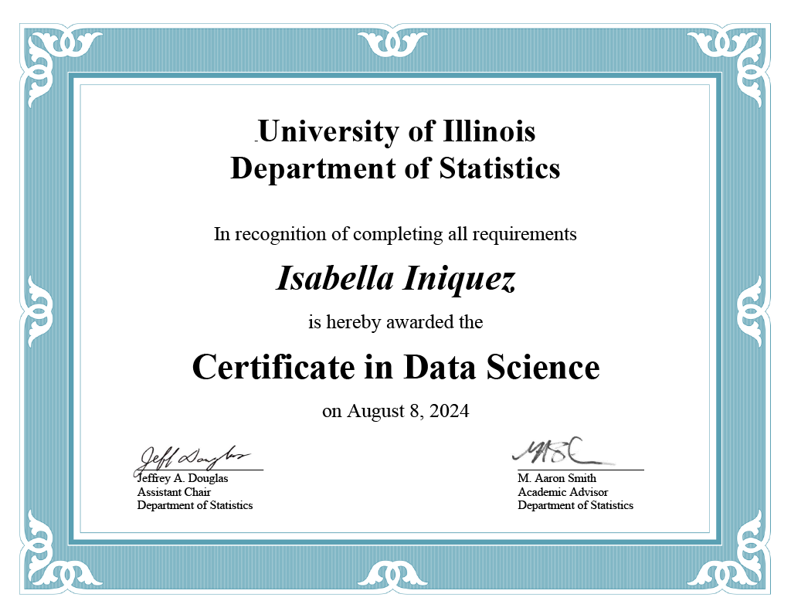

# Certifications

### [UIUC Certificate in Data Science](https://stat.illinois.edu/academics/undergraduate/minors/certificate-data-science)

Relevant Courses Taken:
*   STAT 107: Data Science Discovery 
*   STAT 207: Data Science Exploration
*   MATH 416: Abstract Linear Algebra 
*   STAT 385: Statistics Programming Methods
*   STAT 420: Methods of Applied Statistics
*   CS 225: Data Structures
*   CS 307: Modeling and Learning in Data Science