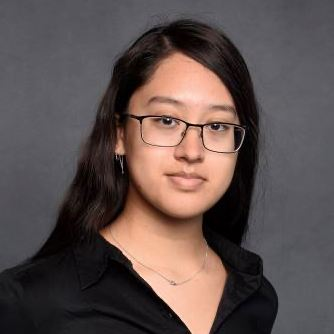

## Hello! Hello! Who am I? Great question!

I'm **Isabella**, a Computer Science Master's Student at UIUC! 

  

With a strong foundation in mathematics and an analytical mindset, I specialize in uncovering meaningful insights from complex datasets. My academic work and projects have equipped me with experience in machine learning, data visualization, and statistical modeling. In addition, I bring a unique perspective shaped by resilience and adaptability. As a first-generation college graduate, I’ve honed my ability to navigate challenges, learn on the fly, and find creative solutions—all of which I bring to the professional world.

I’m driven to apply these skills to real-world challenges, currently seeking entry-level opportunities in analytics, data science, or related fields where I can contribute to impactful projects, grow as a professional, and collaborate with diverse teams!

When I’m not diving into data, you can find me browsing a book store, playing video games, or creating art!

Feel free to explore my page, connect with me on LinkedIn, or reach out directly—I’d love to connect!

Some fun facts! 
-   My highschool nicknames were: Inquisitive Isabella and Rapunzel 
-   My wardrobe is almost entirely grayscale (mainly black)
-   My favorite color is green! 🌱

* * *

Webstite in progress :)

test: [temp file](./temp.html)